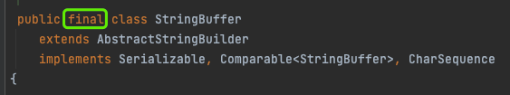

# 测试开发面试题

## 1、测试技能和项目经验

* 请描述一下你现在工作的测试流程是怎样的？
* 测试流程有没有需要改进的地方，这些问题，有反馈并且拿到结果吗？
* 需求不明确，通过哪些方式解决？
* 测试任务多，时间不够，怎么办？
* 如何定位问题是前端问题还是后端问题？
* Web测试和App测试到不同点
* 之前的接口测试是怎么做的
* 如何快速了解一个新的业务，快速上手测试
* 性能测试会关注哪些指标？
    * RT、QPS、TPS、并发量、资源消耗（CPU、内存、网络）
* 针对某一物品设计测试用例（UI测试、功能测试、性能测试、安全测试、易用性测试）
* 针对登陆页面（或者微信的朋友圈）设计测试用例
* session、cookie、token的区别
  * session 存储于服务器，一般用于存储用户状态，有唯一标识符sessionId，sessionId存储在cookie中。服务器收到cookie后解析出sessionId，匹配对应的session。
  * cookie 存储在客户端，装有sessionId。安全性比session差。
  * token 用户信息被加密到token中，服务器收到后解密获取用户信息

## 2、Java 和 Spring 基础

### java中的 “==”和“equals”区别

* == 比较两个对象的内存地址
* equals 比较两个对象的值

### String、StringBuffer、StringBuilder的区别

* 都被final修饰为终态类，不能被继承。
* 
* 
* 
* StringBuffer、StringBuilder都继承AbstractStringBuilder
* StringBuffer 覆写父类方法使用synchronized修饰为线程安全。
* 
* StringBuilder 为线程非安全
* 

### String 常用的方法

* string.split()
* string.substring();
* string.toCharArray();
* string.toLowerCase();
* string.toUpperCase();

### String str1 = "abc" 和 String str2 = new String("abc")的区别

* String str1 = "abc" str1存储的是常量池中的地址值；
* String str2 = new String("abc") str2存储的是在堆中的 new String()的地址值；
* new String()存放的是跟str1相同指向的常量池的地址值。

### ArrayList 和 LinkedList 的异同

* 参见 [about_collection](about_collection)

### ArrayList 和 HashSet 的异同

* 参见 [about_collection](about_collection)

### 数组排序（冒泡、快排）

* 参见 [about_sort](about_sort)

## 3、基本数据库操作

* create table 'tableA'(
  ……
  )
* drop table tableA；
* select * from tableA where id=1；
* select * from tableA where name like 'G%';**% 替代 0 个或多个字符**
* update tableA set column1 = value1, column2 = value2 where id=1;
* insert into tableA values (value1,value2,value3,...);
* insert into tableA (column1,column2,column3,...) values (value1,value2,value3,...);
* delete from tableA where id=2；
* select * from tableA a left join tableB b on a.id=b.id;
* select * from tableA a right join tableB b on a.id=b.id;
* select * from tableA a join tableB b on a.id=b.id;

## 4、常用 Linux 命令

* tail -100f xxx.log
* grep 文件内容 目录/文件，查找文件内容
* find 目录 -name 文件名*，查找文件，* 表示通配
* ps aux、ps -elf、du -sh、df、cd、mkdir、cp、rm、mv

## 5、网络协议

### 简单描述一下在浏览器中输入www.baidu.com，浏览器做了哪些事情

* 1、根据请求的网址进行域名解析（UDP协议），得到目的IP
* 2、得到目的IP和端口后，浏览器使用socket创建套接字连接封装数据，传递给TCP层
* 3、在TCP层封装TCP头（端口号，标识、序列号、确认号、窗口）后，传递给IP层
* 4、在IP层封装IP头（IP地址）后，传递给数据链路层
* 5、在数据链路层封装MAC头（网卡地址），传递给物理层
* 6、在网络上经过多跳路由到目的地
* 7、服务端反向解析收到的内容，然后响应到客户端
  

### TCP建立连接的过程？

### TCP结束连接发过程？

### 三次握手分别发生中断，客户端和服务端会如何处理？

## 6、Java 进阶

### 描述一下Java类初始化的顺序

### 反射的基本原理和使用
* 类被加载到JVM的内存的【元数据区】，生成一个java.lang.class对象，

* 参见[object_init](object_init)

### 线程

* 创建线程的方式（继承Thread类，实现runnable接口）
* 如何启动线程（start()方法启动线程）
* 如何终止线程（使用interrupt()方法通知 vm 打断线程，强制停止线程的stop()被移除）
* start()方法和run()方法的区别
* 线程的状态：
    * **执行new()初始化线程，进入【new】状态**；
    * **调用start()启动线程，进入【runnable】状态**；
    * **获取CPU时间片运行，进入【running】状态**；
    * **获取不到对象锁发生阻塞，进入【Blocked】状态**；
    * **调用wait()，join()，sleep()/sleep(3000)，进入【waiting】或者【TIMED_WAITING(parking)】**；
    * **线程运行结束后，【terminate】状态**）
* 如何唤醒休眠中的线程（notifyAll()）
* 线程执行join()方法后的表现

### 线程池

* 参见 [about_threadPool](about_threadPool)

### 什么是JVM内存结构？

* jvm将虚拟机分为5大区域，程序计数器、虚拟机栈、本地方法栈、java堆、方法区；
* 程序计数器：线程私有的，是一块很小的内存空间，作为当前线程的行号指示器，用于记录当前虚拟机正在执行的线程指令地址；
* 虚拟机栈：线程私有的，每个方法执行的时候都会创建一个栈帧，用于存储局部变量表、操作数、动态链接和方法返回等信息，当线程请求的栈深度超过了虚拟机允许的最大深度时，就会抛出StackOverFlowError；
* 本地方法栈：线程私有的，保存的是native方法的信息，当一个jvm创建的线程调用native方法后，jvm不会在虚拟机栈中为该线程创建栈帧，而是简单的动态链接并直接调用该方法；
* 堆：java堆是所有线程共享的一块内存，几乎所有对象的实例和数组都要在堆上分配内存，因此该区域经常发生垃圾回收的操作；
* 方法区：存放已被加载的类信息、常量、静态变量、即时编译器编译后的代码数据。即永久代，*
  *在jdk1.8中不存在方法区了，被元数据区替代了，原方法区被分成两部分；1：加载的类信息，2：运行时常量池；加载的类信息被保存在元数据区中，运行时常量池保存在堆中；
  **

### 什么是JMM内存模型？

Java 内存模型（下文简称 JMM）就是在底层处理器内存模型的基础上，定义自己的多线程语义。
它明确指定了一组排序规则，来保证线程间的可见性，这一组规则被称为 Happens-Before。
volatile - 保证可见性和有序性
synchronized - 保证可见性和有序性; 通过**管程（Monitor）*保证一组动作的*原子性
编译器在遇到这些关键字时，会插入相应的内存屏障，保证语义的正确性。

### spring 常用的注解？

* @Service、@RestController、@RequestMapping、@Autowire、@GetMapping、@RequestParam、@PostMapping、@RequestBody

### @Autowired、@Resource、@Reference三个注解的作用及使用场景？

* 简单来说三者都可以引入由Spring容器管理的bean；
* @Resource 作用相当于 @Autowired；
* @Resource 和 @Autowired 注入的是本地 spring 容器中的对象；
* **@Autowired** 是 byType 自动注入，是由 Spring 提供的注解；
* **@Resource** 默认 byName 自动注入，是 java 提供的注解。
* **@Reference** 是 dubbo 的注解，也是注入（一般注入的是分布式的远程服务的对象）；

### spring 的 IoC 怎么理解？

* IoC（Inversion of Control 控制反转），是将对象的新建和初始化转交到spring容器，然后通过DI（dependency injection ）注入到对象中。
  Spring 中的依赖注入可以**通过构造函数、setter 或字段来完成**。